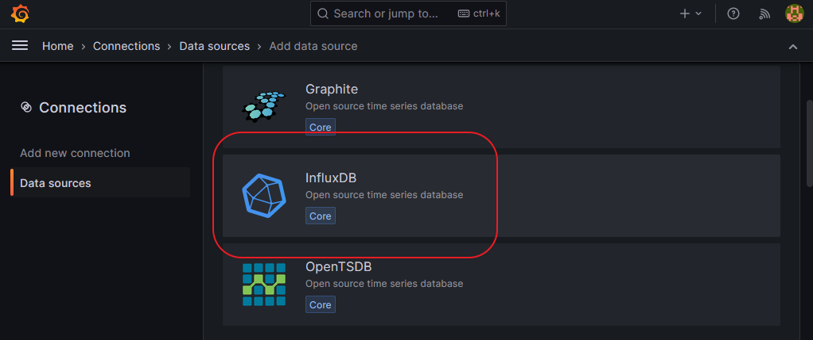
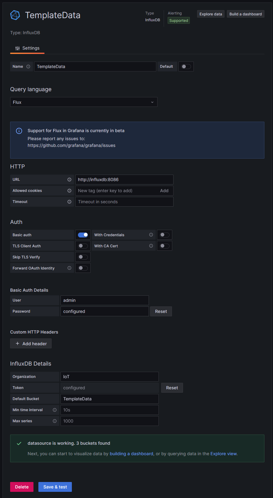
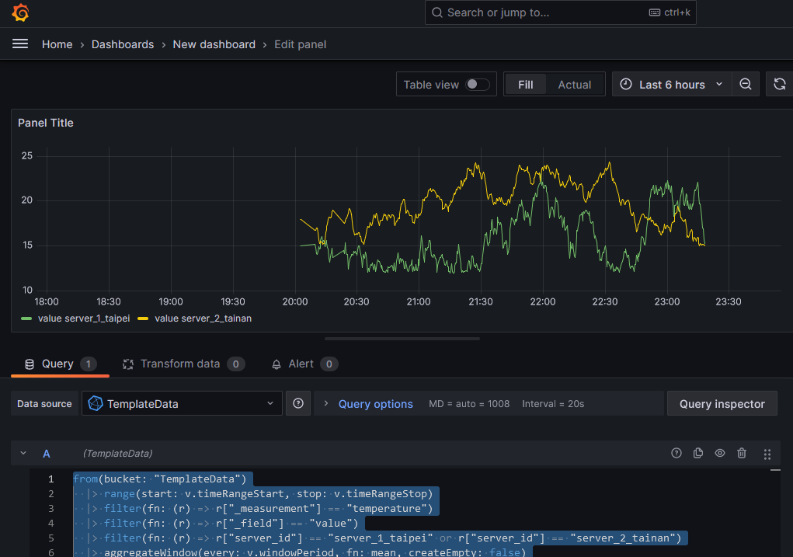
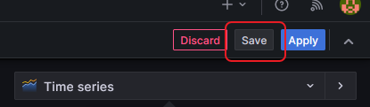
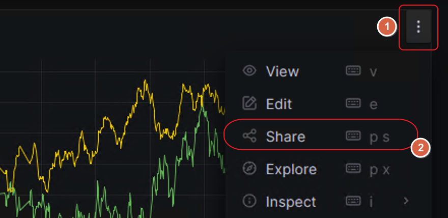
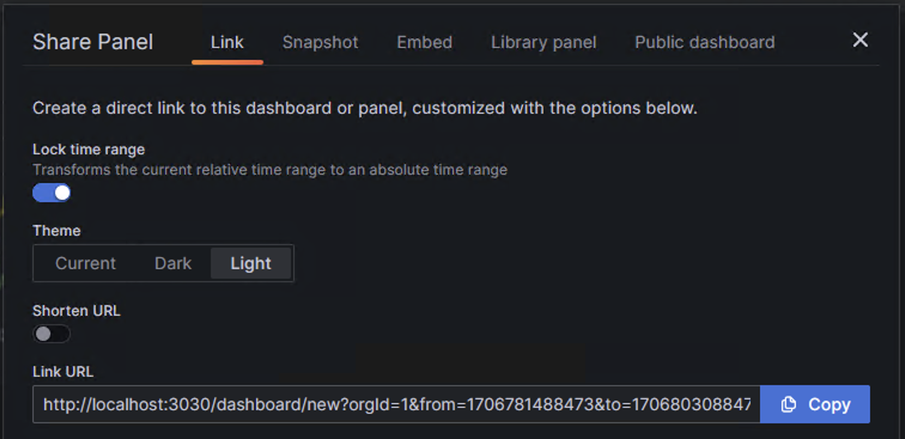

# Docker 安裝與配置指南

本指南將幫助您設置並運行 Grafana 和 InfluxDB 容器。請按照以下步驟操作。

## 配置

首先，您需要配置環境變量，請編輯項目根目錄下的 `.env` 文件進行設置。

### 啟動容器

使用 `docker-compose.yaml` 文件來創建並啟動 Grafana 和 InfluxDB 服務。

```bash
docker compose up -d
```

運行上述命令後，您應該能看到 Grafana 和 InfluxDB 服務已被創建並處於運行狀態。

### InfluxDB 初始設置

訪問 InfluxDB 控制面板：

```
http://localhost:8086
```

按照下圖所示步驟進行設置。測試環境中請使用 `supersecret` 作為密碼。


請記錄下生成的 API Token，例如：

```
BLCddmNWRQqlNwuHDj2X4eEZQNWKoS3zqoKOkRGL3bqU_lMBZVUPAnw2L0VHziRm4Mvamvy76QeUev1jGOMwPg==
```

組織名稱（Organization name）填寫 `IoT`，存儲桶（Bucket）名稱填寫 `TemplateData`。

### Grafana 登錄與配置

訪問 Grafana 控制面板：

```
http://localhost:3030
```

登錄後，添加 InfluxDB 作為數據源。根據[官方文檔](https://docs.influxdata.com/influxdb/v2/tools/grafana/)，我們推薦使用 Flux 作為查詢語言。

由於我們的 Docker 服務已設置網絡，因此請將 URL 設置為：

```
http://influxdb:8086
```




### 查詢和創建儀表板

創建儀表板時，使用以下 Flux 查詢語句（根據需要進行調整）：

```sql
from(bucket: "TemplateData")
  |> range(start: v.timeRangeStart, stop: v.timeRangeStop)
  |> filter(fn: (r) => r["_measurement"] == "temperature")
  |> filter(fn: (r) => r["_field"] == "value")
  |> filter(fn: (r) => r["server_id"] == "server_1_taipei" or r["server_id"] == "server_2_tainan")
  |> aggregateWindow(every: v.windowPeriod, fn: mean, createEmpty: false)
  |> yield(name: "mean")
```

完成後，您將能看到溫度數據的可視化顯示。



請記得保存您的儀表板。



保存後，根據提示操作以分享儀表板。



如果需要對外公開儀表板，請選擇 "Publish Dashboard"。



## 停止服務

當不再需要運行 Grafana 和 InfluxDB 服務時，可以使用以下命令停止並移除容器：

```bash
docker compose down
```

---

請確保提供清晰的圖像路徑，並將所有引用的圖像文件包含在文檔提交中。此外，考慮到面試官的角度，可以在每個步驟後簡要說明該步驟的目的或重要性，以便於理解。