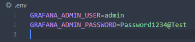
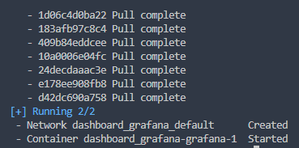
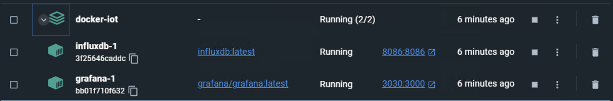
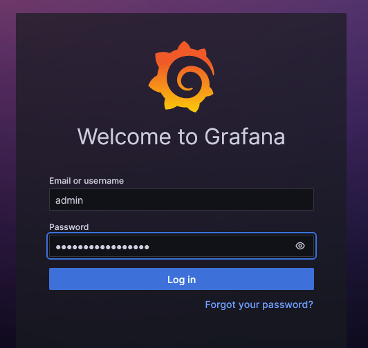
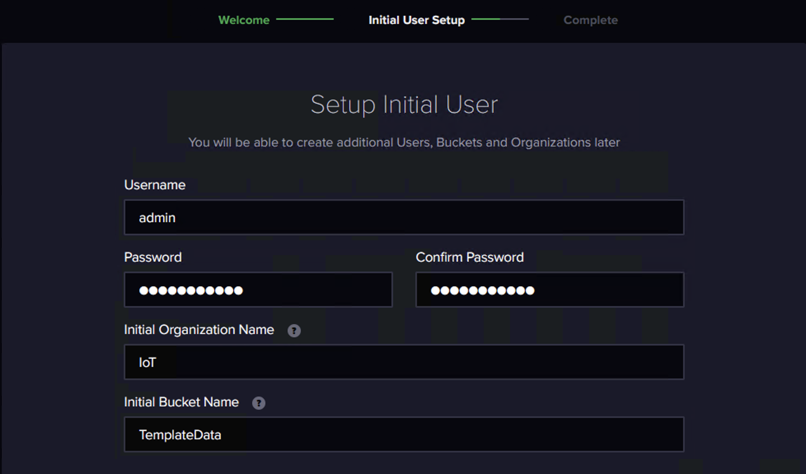

# Docker

## User & Password

請至 `.env` 做設定

## Setup

基於 docker-compose.yaml 安裝



```bash
# start the grafana container
docker compose up -d
```

確認安裝完畢並啟動狀態



應可看到同時完成建立 Grafana 跟 InfluxDB ，並在啟動狀態



登入 Grafana

`http://localhost:3030`



登入 InfluxDB

`http://localhost:8086`

設定如下圖
因為是測試用，密碼請用 `supersecret`，其他模擬器會以此密碼寫入


保存 API Token 如:

`eWLDmfBrxO6SrvtTO2W2PqtnyxMKWfJVkPKVgsYcwv43N_L2OefVk7TN0bP6pBGatSFZP4mG8HHzSEawtCI3eg==`


## Stop

```bash
# Stop the grafana container
docker compose down
```
