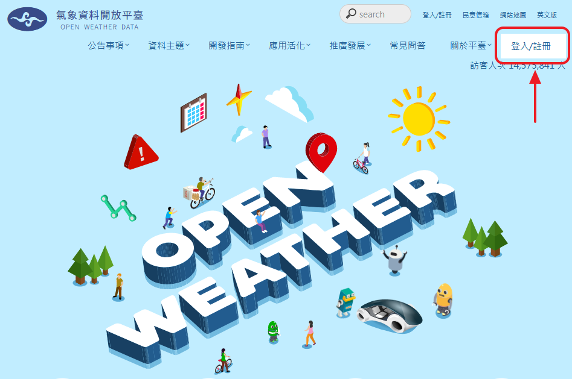
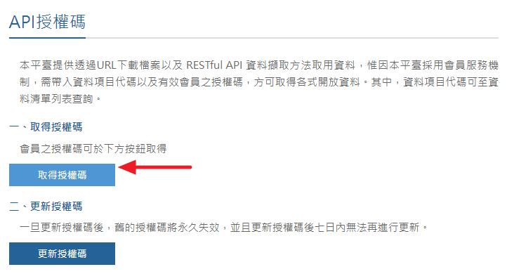
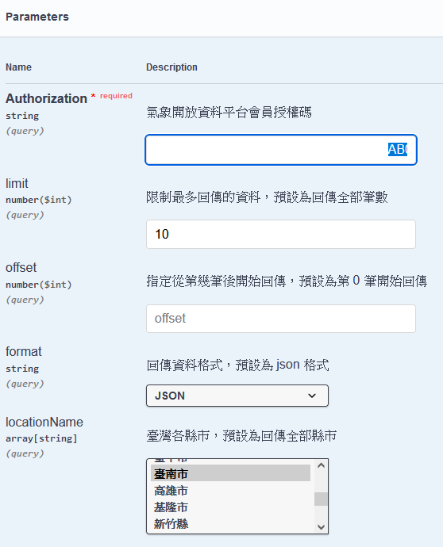
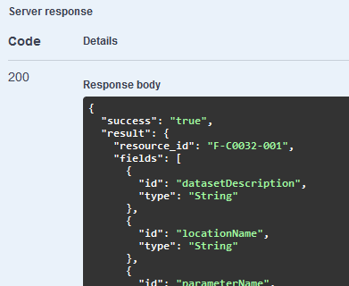

# 取得台灣氣象資料

## 註冊

LINK: [氣象資料開放平台](https://opendata.cwa.gov.tw/index)

先完成註冊



註冊後登入，並取得授權碼



LINK: [氣象資料開放平台 API 預測試](https://opendata.cwa.gov.tw/dist/opendata-swagger.html#/%E9%A0%90%E5%A0%B1/get_v1_rest_datastore_F_C0032_001)

設定授權碼與資料



執行應能 server response



# 安裝

執行 `install.bat`

該項目動作內容為建立虛擬環境，並

```powershell
python -m venv venv
venv\Scripts\activate
pip install flasgger Flask-WTF flake8 black isort mypy flask python-dotenv requests PyYAML
```

# 執行清單

確認路由項目，主要Endpoint為 `weather-endpoint, weather-page-endpoint, locations-endpoint `

```bash
flask routes
```

啟動

1. 基於 `package.json` 做測試，則執行指令
   ```bash
   npm i
   npm run dev
   ```
2. 若是執行flask測試，請在 `./main_console` 路徑下執行
   ```bash
   flask run
   ```
