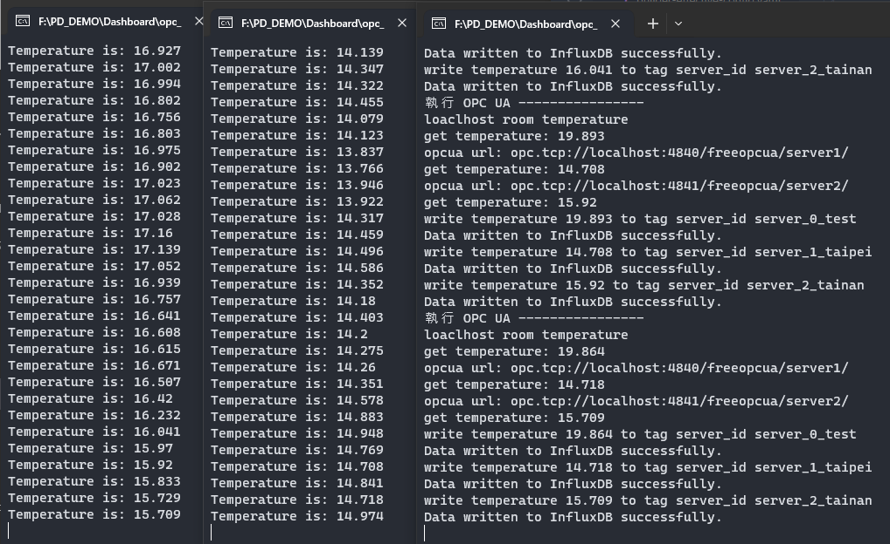
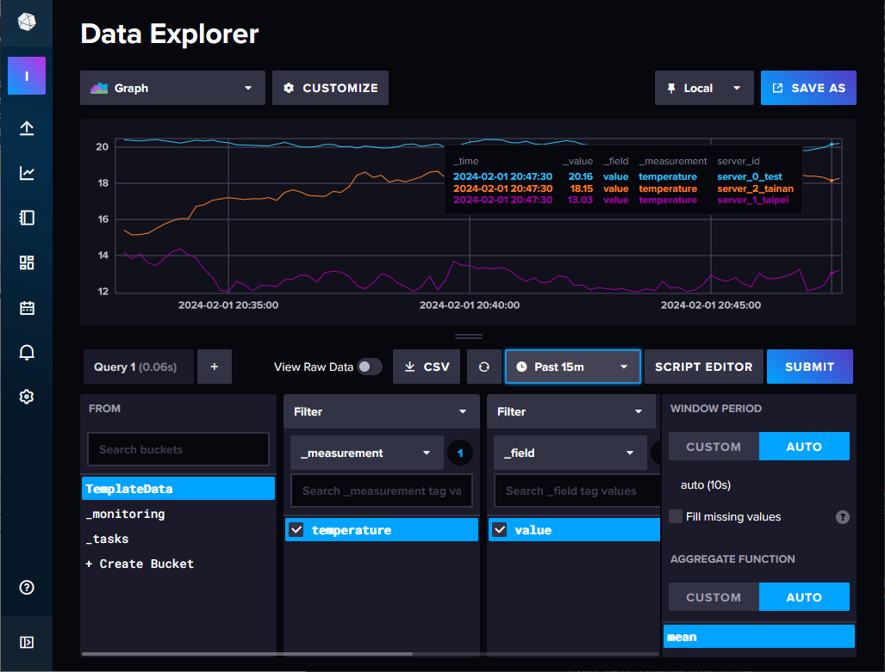

# 模擬 OPC UA 伺服器提供動態溫度節點

本專案模擬工廠中多個監控環境溫度的邊緣裝置。這些裝置建立的 OPC UA 伺服器會定期更新溫度資料，其他軟體透過 OPC UA 協議讀取這些溫度資料，並將其寫入時序資料庫 InfluxDB。

## 安裝步驟

請執行 `Install.bat` 以安裝所需的軟體及其依賴。

手動安裝如下:

這個專案需要使用 Python 環境，我們建議使用虛擬環境（virtual environment）來管理依賴項。

1. 創建虛擬環境（virtual environment）：
   ```bash
   python -m venv venv
   ```

2. 啟動虛擬環境：

- 在 Windows 上：

  ```
  venv\Scripts\activate
  ```
- 在 macOS/Linux 上：

  ```
  source venv/bin/activate
  ```

3. 安裝必要的依賴項：

   ```bash
   pip install opcua influxdb_client pyinstaller
   ```

現在，你已經設置好了 Python 環境並安裝了所需的庫，可以開始使用這個專案了。


## 使用方法

本專案中包含的 Python 腳本可以通過 PyInstaller 工具打包成可執行文件。預設環境（venv）中已安裝 PyInstaller。

請按照以下步驟操作：

首先，在專案根目錄啟動虛擬環境：

```powershell
.\venv\Scripts\Activate
```

切換至 OPC UA 模擬伺服器的目錄：

```powershell
cd .\opc_ua_similar_server
```

使用 PyInstaller 打包腳本：

```powershell
pyinstaller --onefile iot_hub.py
pyinstaller --onefile opc_ua_server_1_taipei.py
pyinstaller --onefile opc_ua_server_2_tainan.py
```

打包完成後，執行 `.\dist` 目錄下的程式。

建議的執行順序如下：

1. `opc_ua_server_1_taipei.exe` - 模擬台北的 OPC UA 伺服器。
2. `opc_ua_server_2_tainan.exe` - 模擬台南的 OPC UA 伺服器。
3. `iot_hub.exe` - 負責從 OPC UA 伺服器讀取資料並寫入 InfluxDB。

若正確執行，應可見如下圖畫面：



若成功寫入資料庫，則應呈現如下圖：



---

請確保所有提及的圖片都包含在文件提交中，並且圖片的路徑正確無誤。這樣可以確保面試官能夠清楚地了解到每一步的操作以及期望的結果。
